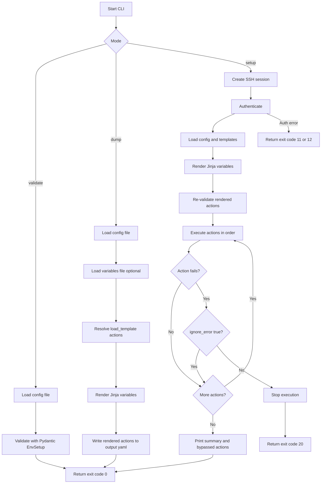

# Contributing to envicorn

Thanks for contributing to `envicorn`.

This document explains how to set up your environment, make changes, and
submit pull requests.

## Prerequisites

- Python 3.10+
- Poetry
- Access to a DUT reachable over SSH for `setup` testing (optional but useful)

## Local Setup

```bash
git clone git@github.com:canonical/envicorn.git
cd envicorn
poetry install
```

Run the CLI from the Poetry environment:Hezn801131!


```bash
poetry run envicorn --help
```

## Repository Structure

- `test_env_setup_util/env_setup.py`: CLI, argument parsing, orchestration
- `test_env_setup_util/libs/model.py`: Pydantic schema definitions
- `test_env_setup_util/libs/operator/`: action implementations
- `test_env_setup_util/libs/ssh_handler.py`: Paramiko and SCP session handling
- `test_env_setup_util/demo/`: sample configs and template usage
- `doc/`: user-facing docs

## Execution Flow Chart



## Making Changes

### 1. Create a branch

```bash
git checkout -b <feature-or-fix-name>
```

### 2. Implement and validate

Common checks used by this repository:

```bash
# Python formatting check (matches CI)
poetry run black --check --diff --line-length 79 ./test_env_setup_util/

# Optional local formatting
poetry run black --line-length 79 ./test_env_setup_util/

# Markdown linting (matches CI intent)
npx markdownlint-cli2 "**/*.md"
```

If your change affects runtime behavior, validate with the demo config:

```bash
poetry run envicorn validate -f test_env_setup_util/demo/example_env_setup.yaml
poetry run envicorn dump -f test_env_setup_util/demo/example_env_setup.yaml -o dump.yaml
```

If you have a reachable DUT, also run `setup` in a safe environment.

### 3. Keep docs and examples in sync

When changing action fields or behavior, update:

- `README.md`
- `doc/USAGE.md`
- `test_env_setup_util/demo/` examples when applicable

## Pull Request Guidelines

- Keep PRs focused and reviewable
- Include a clear summary of what changed and why
- Link related issues or bug reports
- Add before/after behavior notes for CLI or schema changes
- Include command output or logs when fixing operational failures

## Coding Notes

- Prefer small, composable action logic in `libs/operator/`
- Preserve current CLI behavior unless changes are intentional
- Keep error messages actionable for operators running remote setup
- Use typed models in `libs/model.py` for new action fields

## CI Expectations

Current GitHub workflows check:

- Python style and validation workflow
- Markdown linting workflow

Before opening a PR, run the checks listed above to reduce review cycles.

## Reporting Issues

When opening an issue, include:

- Command you ran
- Relevant config snippet (redact secrets)
- Expected behavior
- Actual behavior and full error output
- Environment details (OS, Python version, installation method)
